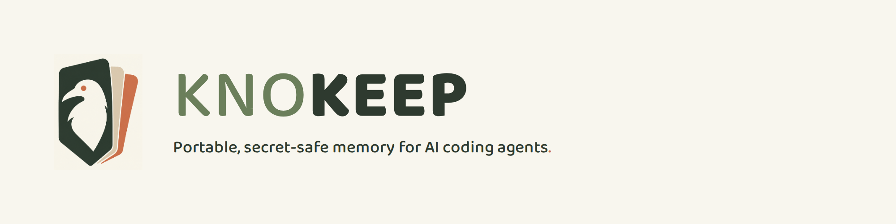
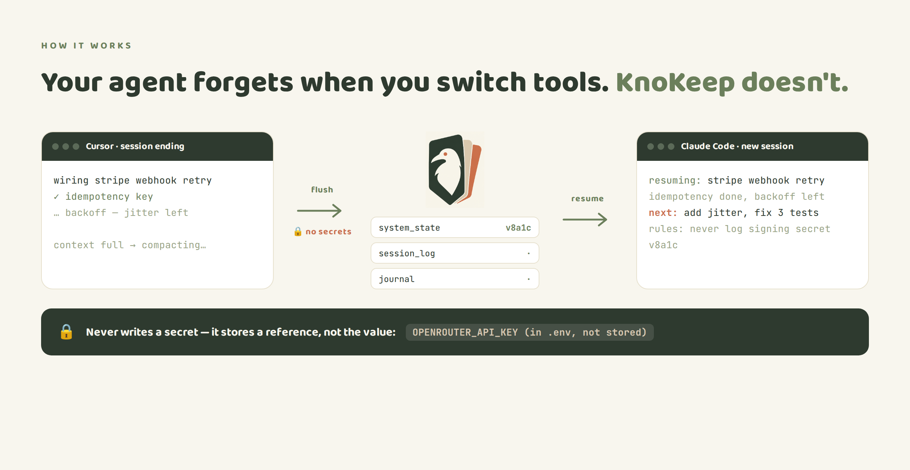

<p align="center">
  
</p>

<p align="center"><b>Portable, secret-safe memory that lets any AI coding agent pick up exactly where the last session left off — even in a different tool.</b></p>

<p align="center">
  <a href="https://github.com/SathiaAI/knokeep/actions/workflows/ci.yml"></a>
  <a href="LICENSE"></a>
  <a href="https://github.com/SathiaAI/knokeep/releases"></a>
</p>

<p align="center">
  <b>Works with</b>&nbsp;
  
  
  
  
  
</p>

<p align="center">
  <sub><b>Planned</b>&nbsp;
  
  
  </sub>
</p>

<p align="center"><i>Part of the Kno suite — <a href="https://github.com/SathiaAI/knosky">Knosky</a> routes to the right file; KnoKeep remembers the work.</i></p>

<br>

<p align="center">
  
</p>

## Contents

- [The problem](#the-problem)
- [What you get](#what-you-get)
- [Who it's for](#who-its-for)
- [How it works](#how-it-works)
- [Quickstart](#quickstart)
- [Secret-safe by design](#secret-safe-by-design)
- [What KnoKeep is not](#what-knokeep-is-not)
- [Docs](#docs)
- [Security](#security)
- [License](#license)

## The problem

Long AI coding sessions forget. The context window fills up and gets **compacted** into a lossy summary — exact paths, versions, the bug you just squashed, the constraint you agreed on — all dropped. So the agent reintroduces a bug it already fixed. Start a **new chat**, or switch from **Cursor to Codex to Claude Code**, and it resets to zero.

The usual workarounds each have a catch: they work in only one tool, or they need a local daemon that can't run in a cloud sandbox, or they mean copy-pasting context by hand. And **none of them scrub secrets** — a real risk, because these agents are reading your `.env`.

## What you get

- **Resume exactly — not a fuzzy recap.** The next session states where you were and what's next before it does anything, then keeps going.
- **One memory across every tool.** Cursor, Codex, Claude Code, and Cowork read and write the same store, so switching tools doesn't reset you.
- **Never a leaked secret.** A fail-closed gate refuses anything credential-shaped and stores a reference instead of the value.
- **You own the data.** The default store is a plain local folder — self-hostable and airgappable. Nothing phones home.

## Who it's for

- **Solo multi-tool builders** who jump between Cursor, Codex, Claude Code, and Cowork and want continuity without babysitting it.
- **Regulated / security-conscious engineers** who need self-hosting, airgapping, and a memory that is safe to keep next to their secrets.
- **Small trusted teams** (today, via a shared database) who want one project memory everyone resumes from.

## How it works

At the start of a session the agent **bootstraps** — reads the store and states its resume line before acting. As work is verified it **flushes**:

- `system_state` — architecture, paths, hard constraints (changes rarely, guarded by a content hash so two sessions can't clobber each other).
- `session_log` — Completed / Active / Next step (changes often).
- `journal` — this session's own append-only log (parallel-safe).

Under the hood it's a single store engine with pluggable backends — a local folder by default, plus git, S3/GCS-style object stores, and Postgres — all behind the same secret gate. The skill your agent runs and the bundled MCP server share that one store, so there is no split-brain.

## Quickstart

**Claude Code / Cowork** (requires Python 3 and Node):

```
/plugin marketplace add SathiaAI/knokeep
/plugin install knokeep@kno
```

**Cursor** → add the rule at `shims/cursor/knokeep.mdc`.
**Codex** → drop in `shims/codex/AGENTS.md`.
**Any tool with a shell** → `python skill/knokeep_state.py bootstrap --project <name>`.

Point every tool at the same store (the default is per-user and shared automatically) and they all resume from one memory.

## Secret-safe by design

KnoKeep reads your project — including files that sit next to secrets — and **never writes a secret down**. Every write passes a single, fail-closed gate. If the content looks like a credential (a known token prefix, a high-entropy value, a credential-shaped assignment or URL) the write is **refused**, and a reference is stored instead:

```
OPENROUTER_API_KEY (in .env, not stored)
```

It's defense-in-depth, not one check: the write gate is backed by a store scan on every resume and by an independent `gitleaks` pass in CI. Because the gate is the one write door, its design was put through an **independent adversarial review by non-Anthropic models** before release, and the findings are pinned as regression tests.

## What KnoKeep is not

Being honest about the edges:

- **Not a code-search / RAG engine.** It remembers *your working state*, not your whole codebase (that's Knosky's job).
- **Not for PHI or payer data.** Storing that is prohibited by design — don't point it at it.
- **Secret detection on freeform prose is best-effort, not a guarantee.** The gate is one of several layers (store scan + gitleaks back it up), but a cleverly disguised secret in plain text can still slip a single heuristic — which is exactly why there's more than one.
- **v0.1.0.** The engine is built, tested, and independently reviewed, but it's young. Expect some rough edges and file issues.

## Docs

- [`docs/SCHEMA.md`](docs/SCHEMA.md) — the frozen, client-neutral memory contract
- [`docs/DATA-CLASSIFICATION.md`](docs/DATA-CLASSIFICATION.md) — what may and may not be stored
- [`docs/THREAT-MODEL.md`](docs/THREAT-MODEL.md) — the security model
- [`design/store_backend_contract.md`](design/store_backend_contract.md) — the contract every backend implements
- [`CHANGELOG.md`](CHANGELOG.md) — release notes

## Security

Found a vulnerability? Please open an issue (or email the maintainer) rather than a public PoC. The secret gate is the one write door and is deliberately conservative; it's backed by a resume-time store scan and an independent `gitleaks` engine in CI, and its design passed an independent non-Anthropic-model adversarial review.

## License

GNU **AGPL-3.0** (see [`LICENSE`](LICENSE) and [`NOTICE`](NOTICE)). AGPL is copyleft **including over a network** — if you run a modified KnoKeep as a service, you must share your source. Use it freely; just keep it open.
