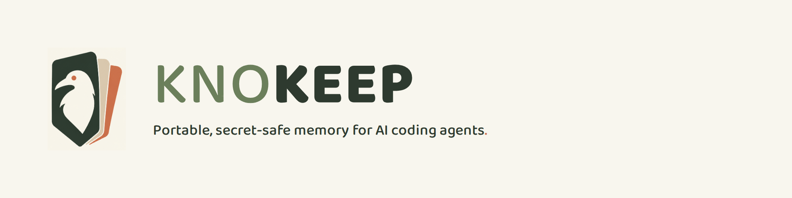

<p align="center">
  
</p>

<p align="center"><b>KnoKeep stores project records that enrolled AI clients can save and resume.</b></p>

<p align="center">
  <a href="https://github.com/SathiaAI/knokeep/actions/workflows/ci.yml"></a>
  <a href="LICENSE"></a>
  <a href="https://github.com/SathiaAI/knokeep/releases"></a>
</p>

<p align="center">
  <b>Client adapters under qualification</b>&nbsp;
  
  
  
  
  
</p>

<p align="center">
  <sub><b>Planned</b>&nbsp;
  
  
  </sub>
</p>

<p align="center"><i>Part of the Kno suite — <a href="https://github.com/SathiaAI/knosky">Knosky</a> routes to the right file; KnoKeep remembers the work.</i></p>

Automatic, faithful capture and reliable cross-client continuation are still being qualified; a saved summary is not an exact conversation transcript. The historical story artwork is not displayed here because its universal secret-detection promise is unsupported.

## Contents

- [The problem](#the-problem)
- [What you get](#what-you-get)
- [Who it's for](#who-its-for)
- [How it works](#how-it-works)
- [Quickstart](#quickstart)
- [Secret detection and limits](#secret-detection-and-limits)
- [What KnoKeep is not](#what-knokeep-is-not)
- [Docs](#docs)
- [Security](#security)
- [License](#license)

## The problem

Long AI coding sessions can lose decisions during compaction or a switch to another client. A new session may need paths, constraints and unfinished work that were never saved to the project.

Shared files, repository instructions and vendor memory are existing alternatives. KnoKeep must demonstrate better capture and continuation against those alternatives; portability alone does not establish an advantage.

## What you get

- **Resume submitted records.** Bootstrap exposes saved state and next steps. Agents must preserve the meaning of decisions and flag contradictions; matching hashes prove bytes, not truth.
- **Portable storage.** Enrolled clients can share a store or carry a verified complete export between environments. Each client still needs a working, tested route.
- **Secret-pattern detection.** The write gate rejects patterns its scanner detects. Store references rather than values; detection is incomplete.
- **Local storage by default.** The CLI can use a local folder. A cloud AI provider sees records supplied to its agent, and remote backends require their own access and trust decisions.

## Who it's for

- **Solo multi-tool builders** who jump between Cursor, Codex, Claude Code, and Cowork and want continuity without babysitting it.
- **Security-conscious engineers** who want local storage and can keep sensitive values out of agent records; this is not a compliance or confidentiality certification.
- **Small trusted teams evaluating a shared record.** Database adapters exist in the engine; the bundled helper currently uses LocalBackend. A shared database client route still needs integration and qualification.

## How it works

At the start of a session the agent **bootstraps** — reads the store and states its resume line before acting. As work is verified it **flushes**:

- `system_state` — architecture, paths, hard constraints (changes rarely, guarded by a content hash so two sessions can't clobber each other).
- `session_log` — Completed / Active / Next step (changes often; use its own expected hash).
- `journal` — this session's append log; stable operation IDs support deduplicating retries within the retained session metadata.

The store engine has local, Git, object-store and Postgres adapters. The bundled skill and MCP server can share a LocalBackend root when configured accordingly. Native MCP registration is a separate client test. State and log are separate writes: they do not yet form one atomic milestone checkpoint.

## Quickstart

**Claude Code / Cowork** (requires Python 3 and Node):

```
/plugin marketplace add SathiaAI/knokeep
/plugin install knokeep@kno
```

**Cursor** → add the rule at `shims/cursor/knokeep.mdc`.
**Codex** → drop in `shims/codex/AGENTS.md`.
**Any tool with a shell** → `python skill/knokeep_state.py bootstrap --project <name>`.

Verify every enrolled tool's store location and project ID. A per-user default on one machine is not automatically shared with a cloud sandbox. Read complete bootstrap fields before acting, preserve unresolved decisions in the current record, and verify exports before ending an ephemeral session. Installation and working shell commands alone do not prove automatic capture.

## Secret detection and limits

Normal writes pass through a gate that refuses detected credential patterns, including known token prefixes and some assignments or URLs. It cannot identify every secret, personal fact or disguised value. Keep sensitive content out of the input and submit a reference after a refusal:

```
OPENROUTER_API_KEY (in .env, not stored)
```

It's defense-in-depth, not one check: the write gate is backed by a store scan on every resume and by an independent `gitleaks` pass in CI. Because the gate is the one write door, its design was put through an **independent adversarial review by non-Anthropic models** before release, and the findings are pinned as regression tests.

## What KnoKeep is not

Being honest about the edges:

- **Not a code-search / RAG engine.** It remembers *your working state*, not your whole codebase (that's Knosky's job).
- **Not for PHI or payer data.** Storing that is prohibited by design — don't point it at it.
- **Secret detection on freeform prose is best-effort, not a guarantee.** Resume-time store scans add another check; gitleaks runs in this repository's CI, not automatically on each user's store. Disguised or unrecognized sensitive values can escape detection.
- **v0.1.0.** The engine is built, tested, and independently reviewed, but it's young. Expect some rough edges and file issues.

## Docs

- [`docs/SCHEMA.md`](docs/SCHEMA.md) — the frozen, client-neutral memory contract
- [`docs/DATA-CLASSIFICATION.md`](docs/DATA-CLASSIFICATION.md) — what may and may not be stored
- [`docs/THREAT-MODEL.md`](docs/THREAT-MODEL.md) — the security model
- [`design/store_backend_contract.md`](design/store_backend_contract.md) — the contract every backend implements
- [`CHANGELOG.md`](CHANGELOG.md) — release notes

## Security

Found a vulnerability? Please open an issue (or email the maintainer) rather than a public PoC. The secret gate is the one write door and is deliberately conservative; it's backed by a resume-time store scan and an independent `gitleaks` engine in CI, and its design passed an independent non-Anthropic-model adversarial review.

## License

GNU **AGPL-3.0** (see [`LICENSE`](LICENSE) and [`NOTICE`](NOTICE)). AGPL is copyleft **including over a network** — if you run a modified KnoKeep as a service, you must share your source. Use it freely; just keep it open.

---

KnoKeep is built and run by [Viaknox](https://viaknox.com/products).
